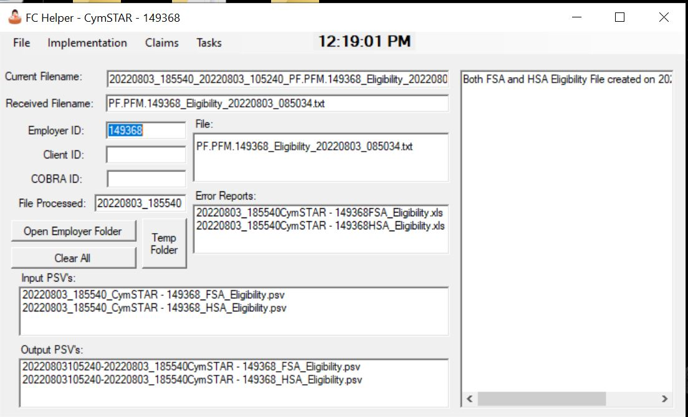
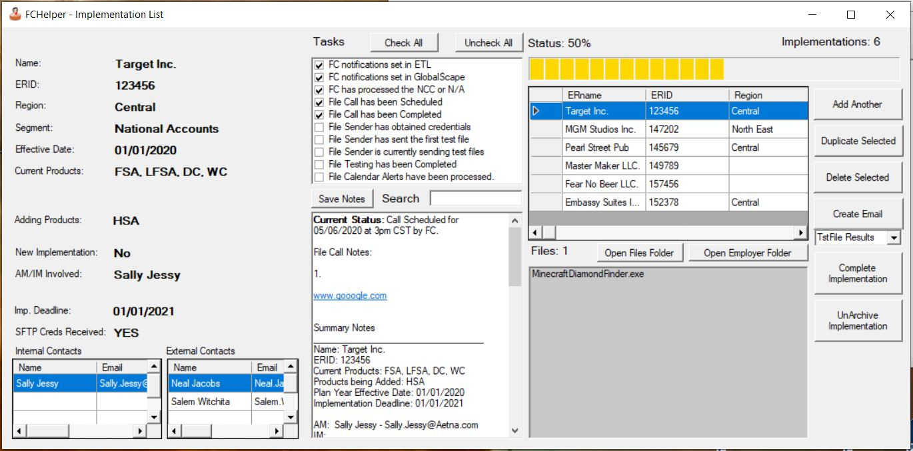

# FCHelper

## Overview

**FCHelper** is a Windows desktop application designed to support **EDI File Consultants** working in the insurance domain. The tool was originally created to streamline and centralize the management of **HSA and FSA file feed implementations**, while also serving as a powerful utility for **EDI file discovery and processing**.

FCHelper functions as a one-stop operational hub for tracking implementation progress, managing contacts, and navigating complex EDI file structures.

---

## Primary Use Case: Implementation Tracking

FCHelper’s primary purpose is to manage and track **new file feed implementations**. It provides at-a-glance visibility into:

- Current implementation status
- Work completed vs remaining
- Files involved in the implementation
- Key internal and external contacts
- Ownership and responsibility tracking

Key features include:
- Add, duplicate, delete, archive, and unarchive implementations
- Quick access to all implementation-related metadata
- One-click generation of **tailored emails** to implementation contacts
- Drag-and-drop ingestion of Word documents  
  - Automatically extracts relevant information
  - Populates the implementation record without manual entry

This significantly reduces administrative overhead and improves consistency across implementations.

---

## Secondary Use Case: EDI File Discovery & Processing

FCHelper also acts as a productivity tool for **EDI file investigation and processing**.

Capabilities include:
- Drag-and-drop file inspection
- Automatic discovery of related input/output EDI files
- Visibility into HSA/FSA error reports generated by downstream ETL processes
- Rapid navigation of complex directory structures
- Additional EDI processing utilities commonly required by File Consultants

This allows users to quickly understand file lineage, diagnose issues, and locate related artifacts without manually traversing directories.

---

## Requirements & Limitations

> ⚠️ **Important Notes**

- FCHelper depends on a **specific ETL file structure** to enable many of its EDI-related features.
- The application **does not install or configure** the ETL file structure automatically.
- Several class files are intentionally **excluded from this repository** because they contain confidential or proprietary logic.

As a result, some advanced EDI functions may not operate without the expected environment in place.

---

## Intended Audience

- Insurance EDI File Consultants
- Integration analysts supporting HSA/FSA file feeds
- Operational teams managing multiple concurrent file implementations

---

## Status

This project reflects a **production-used internal tool** developed to solve real operational problems. Portions of the implementation have been removed or generalized for confidentiality.

---

## Disclaimer

This application is provided for reference and demonstration purposes. It is not intended to be deployed without proper adaptation to the required ETL environment.
